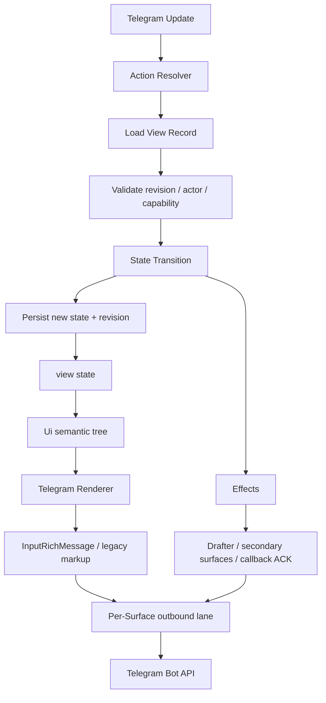

<div align="center">

# `teloxide-ui`

**Declarative, server-driven UI for Telegram bots in Rust.**

Built on [`teloxide`](https://github.com/teloxide/teloxide) and designed around
Telegram Rich Messages, callback actions, ephemeral surfaces, and deterministic
server-side state.


</div>

> [!WARNING]
>
> This repository is an early design and implementation workspace. Public APIs
> are intentionally unstable until the core state/action/render invariants have
> been proven by real applications.

## What is this?

`teloxide-ui` is a **separate crate built on top of teloxide**. It is not a
teloxide subsystem and it does not attempt to turn teloxide itself into a UI
framework.

The central model is server-driven:

```text
Telegram event
    ↓
typed Action
    ↓
server-side State transition
    ↓
view(State) → Ui
    ↓
Telegram renderer
    ↓
replace/update Surface
```

The Telegram client renders the result and sends interaction events back. It
does not own authoritative application state or application logic.

The closest architectural reference is hypermedia / HTMX:

```text
event → request → server computes representation → replace target
```

Telegram is not a browser, however. There is no DOM patch protocol and there is
no reason to invent one. The main mutable UI target is a Telegram **Surface**
(usually one message), while components are purely server-side composition.

## Why now?

Telegram Bot API 10.3 makes Rich Messages useful as interactive application
surfaces: rich-message callback buttons, button rows, disabled states, native
styles, ephemeral message flows, and richer editing primitives can be combined
with typed bot-side state.

This crate aims to provide the missing application layer:

- typed actions instead of handwritten callback strings;
- server-side state and revisions;
- pure declarative views;
- Telegram Rich Message rendering;
- stale callback detection;
- serialized per-surface projection;
- latest-wins render coalescing;
- optional persistence and durable rendering;
- ephemeral per-user UI;
- semantic button labels with Telegram custom-emoji support;
- integration with teloxide's scheduler and Drafter without duplicating them.

The current MVP already provides the semantic `Ui` builder, versioned opaque
action registry, actor/TTL/stale checks, an optimistic in-memory `UiStore`, a
Rich Message renderer, and a per-surface worker using teloxide's outbound
queue. Callback dispatch/ACK remains application-owned for now; the chess
reference example demonstrates that complete flow without putting it into the
core runtime. Persistence and Drafter effects are still outside this first
slice.

## Non-goals

`teloxide-ui` is deliberately **not**:

- a browser DOM implementation;
- React with Telegram-shaped widgets;
- a CSS/layout engine;
- a Mini App replacement for arbitrary client-side applications;
- a place to duplicate teloxide transport primitives;
- a state store hidden inside `callback_data`;
- a requirement for all teloxide bots.

## Core concepts

### `State`

Authoritative application state lives on the server.

```rust
#[derive(Clone)]
struct Counter {
    value: i64,
}
```

### `Action`

Buttons and other interactions identify typed actions.

```rust
#[derive(Clone, Debug)]
enum Action {
    Increment,
    Decrement,
    Reset,
}
```

The final Telegram `callback_data` is a transport encoding, not the domain API.

### `View`

A view is a pure projection:

```text
State → Ui<Action>
```

It must not perform Telegram requests, mutate persistent state, or hide network
side effects.

### `Ui`

`Ui` is a semantic server-side tree. It describes things Telegram can actually
render: text, paragraphs, headings, button rows, tables, details, media, and
similar primitives.

It is intentionally not pixel-layout.

The MVP also includes a semantic `Table` node. A table cell may contain plain
text, be intentionally empty, or contain an action button. The Rich renderer
maps it to Telegram's native table block and keeps action registration on the
server; it does not expose browser-style layout or DOM identity.

`Ui::blockquote` and `Ui::details` provide the native callout and collapsible
history primitives used by the chess reference. They are semantic Telegram
blocks, not general-purpose layout containers.

Button labels are semantic too. Plain strings use `ButtonLabel::Plain`; a
Telegram custom emoji can be passed as
`ButtonLabel::custom_emoji(id, alternative_text)`. The renderer emits the Rich
Message object and keeps the fallback text beside it for clients or surfaces
that cannot show the custom emoji.

The chess reference uses Telegram's compact striped Rich Message table for the
checkerboard surface. Transparent flat 2D custom emoji provide the pieces;
buttons are layered only on occupied or currently legal cells, so empty base
cells remain native table cells instead of becoming padded emoji-buttons. The
published piece/state palette is documented in
[`assets/chess-emoji/README.md`](assets/chess-emoji/README.md). The complete-cell
sprites remain available as an alternate experiment in
[`assets/chess-emoji-reference-v2/README.md`](assets/chess-emoji-reference-v2/README.md).

### `Surface`

A `Surface` is an independently rendered Telegram target, for example:

- a normal chat message;
- an inline message;
- an ephemeral message delivered to one user.

A surface is the ordering boundary for projection.

### `Effect`

State transitions may request effects in addition to re-rendering, for example:

- render another surface;
- send a new surface;
- show a callback toast/alert;
- delete a surface;
- start a Drafter-backed streaming operation.

Effects are explicit. `view()` stays pure.

## Intended API shape

The exact API is not stable yet. The target ergonomics are roughly:

```rust,ignore
#[derive(Clone)]
struct Chess {
    board: Board,
    selected: Option<Square>,
}

#[derive(Clone, Debug)]
enum Action {
    Select(Square),
    Undo,
    NewGame,
}

impl Component for ChessApp {
    type State = Chess;
    type Action = Action;

    fn view(
        &self,
        state: &Self::State,
        cx: &ViewCx<Self::Action>,
    ) -> Ui<Self::Action> {
        let mut ui = Ui::column()
            .push(Ui::heading("Chess"));

        for rank in state.board.ranks() {
            let mut row = Ui::button_row();

            for square in rank {
                row = row.push(
                    Ui::button(state.board.label(square), Action::Select(square))
                        .disabled(!state.board.selectable(square))
                );
            }

            ui = ui.push(row);
        }

        ui.push(
            Ui::button_row()
                .push(Ui::button("Undo", Action::Undo))
                .push(Ui::button("New game", Action::NewGame))
        )
    }
}
```

A future macro may reduce syntax, but the builder API comes first so the
semantic model can stabilize before proc-macro syntax freezes it.

## Architecture



See [`docs/ARCHITECTURE.md`](docs/ARCHITECTURE.md) for the detailed runtime
contract.

## Chess reference

The first application on top of the kit is [`examples/chess.rs`](examples/chess.rs).
It renders an 8×8 board as Rich Message button rows, stores the board on the
server, acknowledges callbacks before projection, and edits one Telegram
message through `SurfaceWorker`. The complete runbook and deliberate MVP rule
scope are in [`docs/CHESS_REFERENCE.md`](docs/CHESS_REFERENCE.md). Every cell
is an action target; legal moves are calculated from the authoritative board on
the server, and the custom emoji for pieces and cell states come from the
published flat 2D set.

## Relationship with teloxide

This project depends on teloxide; it does not live inside teloxide.

During early development the dependency is pinned to
[`Mar2ianen/teloxide-fork`](https://github.com/Mar2ianen/teloxide-fork), which
exposes the Bot API 10.3 Rich Message surface and the generic outbound and
Drafter infrastructure needed by the runtime. The dependency is pinned to
fork commit `a6092220`, which exposes `outbound` as an opt-in teloxide feature
and keeps the UI crate independent from teloxide internals.

Some discoveries may still belong in teloxide itself. The rule is:

> If a primitive is useful to ordinary teloxide applications without knowing
> about `Ui`, `Component`, `Action`, `UiStore`, or this runtime, it is a
> candidate for teloxide. Otherwise it stays here.

Examples of plausible teloxide-side work:

- missing generic Bot API types or validation;
- reusable request/edit abstractions;
- scheduler capabilities that are transport-generic;
- generic ephemeral-message identifiers or helpers;
- Drafter capabilities useful outside declarative UI.

Examples that belong here:

- action registries;
- callback capability tokens;
- `Ui` trees;
- component/view APIs;
- `UiStore`;
- UI revisions;
- surface render workers;
- renderer policy.

See [`docs/TELOXIDE_BOUNDARY.md`](docs/TELOXIDE_BOUNDARY.md).

## Concurrency model

Two orderings must not be conflated.

**State transitions** are ordered by view/session revision.

**Telegram projection** is ordered by surface.

The runtime must never keep a state-store lock while performing a Telegram
request.

A typical flow is:

```text
load state
→ validate revision
→ apply action
→ commit state revision
→ unlock
→ render desired representation
→ enqueue projection on Surface lane
```

If revisions 41, 42, and 43 are produced before Telegram catches up, pending
projection may coalesce to revision 43. An already-started older Telegram
request is never treated as if it did not happen; the per-surface lane preserves
final ordering.

## MVP API

The first usable slice can be assembled from the public types without a macro:

```rust,ignore
let view_id = ViewId::fresh();
let revision = Revision::INITIAL;
let registry = ActionRegistry::new();
let renderer = RichRenderer::new(registry.clone());

let ui = Ui::column().push(
    Ui::button_row().push(Ui::button("+1", Action::Increment)),
);
let rendered = renderer.render(
    &ui,
    RenderContext::new(view_id, revision),
)?;
```

`rendered.rich_message` is ready for a teloxide Rich Message send/edit
request. Each enabled button is represented by an opaque `ActionToken`; the
registry retains its typed action and validates actor, view, expiry, and stale
revision before application dispatch. `SurfaceWorker::project` admits the
complete representation through a shared `OutboundQueue` and keeps updates for
one surface serialized and latest-wins while they are still pending.

## Callback data

Telegram callback payloads are small and untrusted. Application state is never
authoritative inside them.

The intended default is an opaque capability-like token:

```text
tu1:4Tqf9vN7sQ
```

Server-side metadata may bind it to:

```text
view id
revision
typed action
allowed actor
expiry
```

An inline codec may exist for tiny stateless actions, but the runtime contract
must remain identical.

## Ephemeral UI

Ephemeral messages are first-class surfaces because their addressing and edit
semantics differ from ordinary messages.

They are excellent for per-user menus, confirmation flows, settings, and
drill-down UI from a shared message.

They are **presentation**, not durable truth. A successful domain operation must
not become true only because an ephemeral projection happened to render.

## Drafter integration

Drafter remains a specialized streaming lifecycle machine.

`teloxide-ui` must not absorb or reimplement it.

The runtime may expose Drafter-backed effects for:

- LLM streaming;
- progress previews;
- native rich drafts;
- native Stop handling;
- long-running generation.

Ordinary state-driven rendering goes directly through the regular renderer and
shared outbound infrastructure.

## Repository status

Implemented MVP:

- semantic `Ui` AST;
- message, inline, and ephemeral surface addressing;
- opaque, versioned callback registry with actor/TTL/stale validation;
- `ViewId` and monotonic `Revision` values;
- optimistic-concurrency in-memory store;
- Rich Message renderer;
- per-surface serialized projection through teloxide `OutboundQueue`;
- latest-wins pending render admission;
- chess reference application.

Callback dispatch/ACK, persistence, durable outbox recovery, legacy rendering,
Drafter effects, and the counter reference application come later.

See [`docs/ROADMAP.md`](docs/ROADMAP.md).

## Development

The current MSRV is Rust `1.88`, matching the resolved dependency graph and
the CI toolchain.

Typical checks:

```bash
cargo fmt --all -- --check
cargo clippy --all-targets --all-features -- -D warnings
cargo test --all-features
cargo test --doc
cargo doc --no-deps --all-features
```


Read [`AGENTS.md`](AGENTS.md) before making architectural changes.

## License

MIT. See [`LICENSE`](LICENSE).
